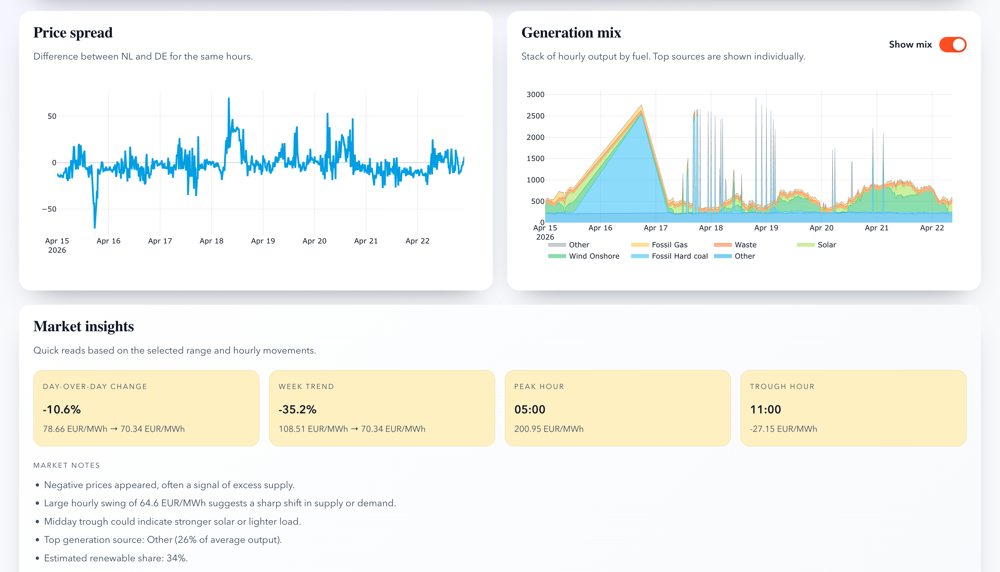
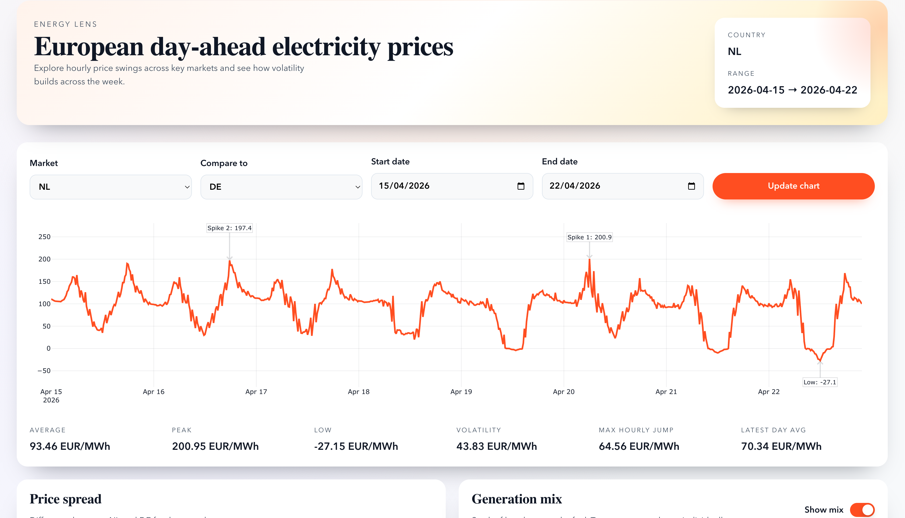

# Energy Lens

European energy price dashboard with a FastAPI backend and a React frontend.

## Highlights

- Real ENTSO-E day-ahead price ingestion with SQLite caching
- Interactive price chart with spikes, volatility, and spread analysis
- Generation mix stacked chart and spike-hour overlays
- Insight cards with day-over-day and week trend comparisons

## Demo

## Architecture

- Frontend: React + Plotly for interactive charts
- Backend: FastAPI + SQLAlchemy for data and caching
- Data: ENTSO-E Transparency Platform (day-ahead prices + generation mix)
- Storage: SQLite (swap to Postgres when needed)

## Features

- Country and date range selection for price trends
- Spread chart between two markets
- Generation mix visualization by fuel type
- Market insights derived from the selected window

## Local development

Backend:
- cd backend
- python -m venv .venv
- source .venv/bin/activate
- pip install -r requirements.txt
- uvicorn app.main:app --reload --port 8000

Frontend:
- cd frontend
- npm install
- npm run dev

## Docker development

- cp .env.example .env
- docker compose up --build

## Environment variables

- ENTSOE_API_KEY: ENTSO-E API key
- OPENAI_API_KEY: OpenAI key (optional)
- ANTHROPIC_API_KEY: Anthropic key (optional)
- DATABASE_URL: SQLite database URL
- VITE_API_URL: Backend base URL for the frontend

## Deployment (quick guide)

- Build containers with Docker Compose locally to verify production parity.
- For a hosted demo, deploy backend and frontend as separate services.
- Use environment variables for API keys and base URLs.
